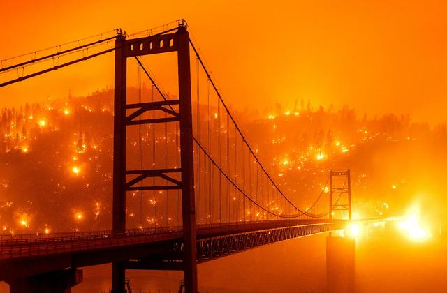
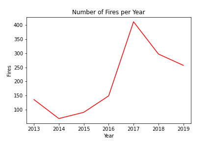
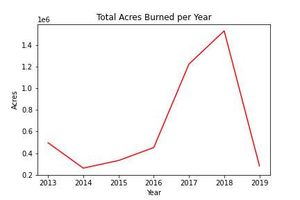
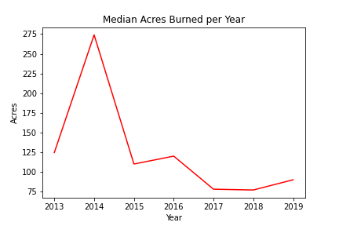
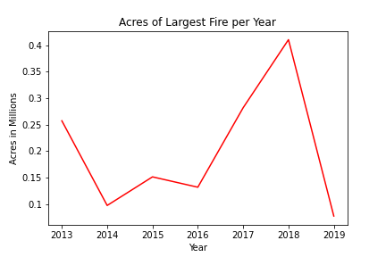
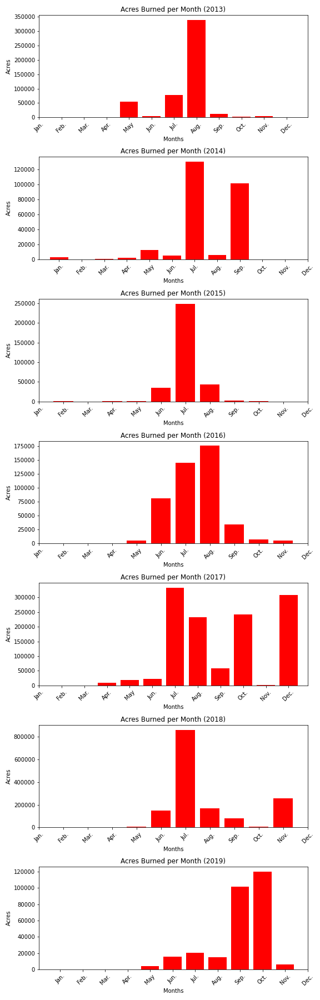
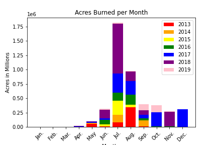
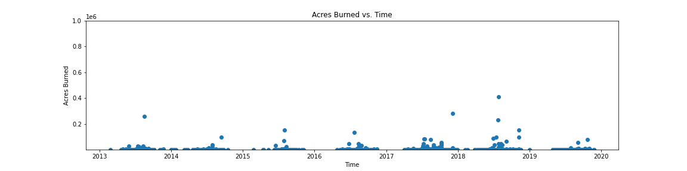
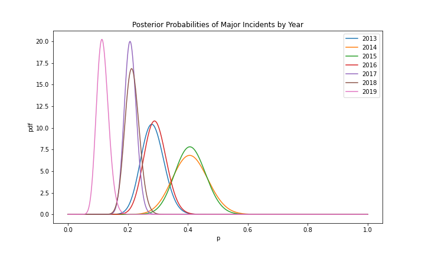

# ca-fire-incidents
A peak into the California Wildfires.

# Introduction
California is known to have some of the most devastating wildfires in the country, and in recent years, it feels as though they are getting worse. However, what does 'worse' mean? Are the number of fires increasing? Are the fires causing more damage to the land? Do people believe fires are a major incident? This presentation will focus on these questions and see if these wildfire seasons are changing. And if so? How?

# Data
The data used in this presentation were taken from [Kaggle](https://www.kaggle.com/ananthu017/california-wildfire-incidents-20132020). This data only focus on the years from 2013 to 2019. It lists each fire with information of where it was, what it took to extinguish it and the damage it caused. The data originally had 1,636 observations and 40 attributes each. However, this presentation will not be utilizing all of them.

To answer the questions above, only 10 columns are going to be utilized from this dataset. After the data cleaning, the dataset consists of 1,410 observations and 10 attributes.

1. UniqueID: an ID number for each fire

2. Name: the name of the fire

3. Counties: the county the fire started in

4. StartYear: the start year of the fire

5. StartMonth: the start month of the fire

6. StartDate: the start date of the fire

7. AcresBurned: number of acres damaged

8. Latitude: latitude of fire location

9. Longitude: longitude of fire location

10. MajorIncident: a binary response of True or False determining whether the fire was considered a 'major incident'

# EDA

To see how these plots and calculations were produced or found, please reference the [ca-fires-final.ipynb](/src/ca-fires-final.ipynb) file in the src folder.

# Nature of the Fires

 

 

These line plots help to reveal some insight into what kind of fires are burning throughout California. The line plot describing the number of fires shows that despite the decrease in fires after 2017, the number of fires is still growing overall. However, does that mean that there is more damage? The other three line plots describe the nature of these fires. 'Total AcresBurned per Year' shows that the total area of land affected by these fires was increasing until 2019. With further research, it was said that 2019 was an 'anomaly' to scientists. 2019 had heavy rains, which prevented the wildfires from getting out of control and burning too much land. 'Median AcresBurned per Year' shows that most years had mostly small fires with the exception of 2014. The median fires for all the years other than 2014 were relatively small compared to the median fire for 2014. 'Acres of the Largest Fire per Year' helps to show that the largest fires were in the years 2017 and 2018, which explains the sharp increase in those years for the 'Total AcresBurned' plot.

# Distribution of Acres Burned by Month

These bars plot show that in the earlier years, more acres are burned in the spring and summer time. However by 2019, there is a shift where more acres are burning in the summer and fall time.

# Proportions of Acres Burned for Each Year

This stacked bar plot shows that the proportion of acres burned for each month increases by each year until 2019. 2017 and 2018 appear to contribute the most especially in July to December.

# Hypothesis Testing
1. Correlation Test

H0: There is no trend for the number of acres burned by the California Fires over the years 2013-2019.

H1: The number of acres burned by the California Fires has been increasing over the years.

The level of significance used is 0.05 or 5%. Since the p-value, 0.6373, is greater than our level of significance, the data fails to reject the null hypothesis. Therefore, there is no evidence that the number of acres burned are increasing over the years 2013-2019.

2. Bayes Hypothesis Test

These distribution plots show that the probability of a fire being considered a major event decreases from 2013-2019. After calculations, the probability of a fire being considered a major increase in 2013 less often than in 2019 was 0%. This shows that there was definitely a decrease in people's perception of whether a fire was a major incident. In comparison to the year 2018, the probability was still only 6%. People do not believe fires are major incidents as much as they did in 2013.

# Conclusion
Overall, the number of fires in California are increasing along with when these fires are occurring. Wildfire season is changing from spring and summer to summer and fall. However, the 'severity' or how much damage these fires are causing cannot be proven to be increasing. People are also not as concern for fires as a major incident as they were in the past. This could be due to many reasons. The number of fires are increasing, but the acres do not appear to be increasing. So, people are probably only seeing smaller fires, which is not as major as a bigger fire.

# Further Testing
Some things to consider for further testing would be:
1. To increase the time period: this would give a better idea of the progression of wildfire seasons in California
2. Test for a relationship with temperature: temperature could shed some light on how wildfires are changing along with climate change

