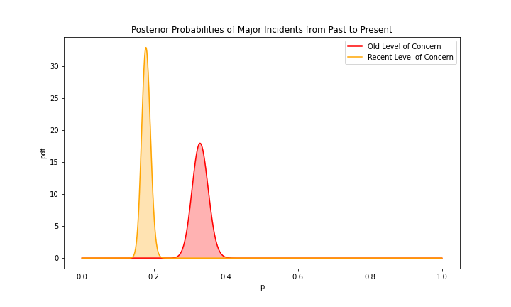

# California Fire Incidents
A peek into the California Wildfires.

    

# Introduction
California is known to have some of the most devastating wildfires in the country, and in recent years, it feels as though they are getting worse. However, what does "worse" mean? According to the United States Forest Service, they "evaluate the SFDI (Severe Fire Danger Index) against the number of newly reported wildfires and total area burned from agency fire reports". Therefore, I will analyze the change in number of fires over the years against the change in the nature of fires to see if the wildfires are getting worse.

# Data
The data used in this project was taken from [Kaggle](https://www.kaggle.com/ananthu017/california-wildfire-incidents-20132020). This data only focused on the years from 2013 to 2019. It lists each fire with information of where it was, what it took to extinguish it and the damage it caused. The data originally had 1,636 observations and 40 attributes each. However, this project will not be utilizing all of them.

To answer the question above, only 10 columns are going to be utilized from this dataset. After the data cleaning, the dataset consists of 1,410 observations and 10 attributes.

1. **UniqueID:** an ID number for each fire

2. **Name:** the name of the fire

3. **Counties:** the county the fire started in

4. **StartYear:** the start year of the fire

5. **StartMonth:** the start month of the fire

6. **StartDate:** the start date of the fire

7. **AcresBurned:** number of acres damaged

8. **Latitude:** latitude of fire location

9. **Longitude:** longitude of fire location

10. **MajorIncident:** a binary response of True or False determining whether the fire was considered a "major incident"

# Number of Fires vs. Nature of Fires

To see how these plots and calculations were produced or found, please reference the [ca-fires-final.ipynb](/src/ca-fires-final.ipynb) file in the src folder.

To begin my analysis on the change in the number and nature of these fires, I wanted to see where these fires a located. Here is a map showing the locations of each fire for each year. You can see that the frequency of fires increases over the years, and they tend to cluster around Southern California, the bay area, and Sacramento.

    

As a sanity check to make sure that the map is showing an increase in fires over the years, here are the numbers to prove it. You can see that the number of fires are increasing with a spike in 2017 and a decrease after that.

| Year  | Number of Fires |
| :--:  | :--:  |
| 2013  | 136 |
| 2014  | 69  |
| 2015  | 91  |
| 2016  | 149 |
| 2017  | 411 |
| 2018  | 297 |
| 2019  | 257 |

However, the chart above only represents the number of fires. Some of these fires could be little spots that were able to be stomped out. Let's get a better look at the nature of these fires or the amount of damage they caused using acres burned as the metric. Here is a line graph of the total acres burned, maximum acres burned, and median acres burned. The log was taken for each of these data points in order to find the general trend of this data. You can see that the total acres burned and maximum acres burned generally increase until 2019. However, the median acres burned peaked in 2014 and decreased after that. This indicates that recent years have seen a few large fires, but 2014 had the most consistently large fires compared to other years.

    

# Bayes A/B Testing

Now that we have seen the number and nature of these fires, let's take a look at how dangerous they were from the people's perspective. The data contains a column named "MajorIncident", which indicates whether each fire was considered important or not. What do I mean by "important"? An example of a "major incident" fire would be the Camp Fire in Paradise during 2018. This fire was so devastating and as a result was labeled "True" for "MajorIncident". Basically, it's one thing to analyze the number and nature of these fires. I also wanted to analyze the public's perspective of these fires by conducting a Bayes A/B test. I split the data into an "old" group and a "recent" group. The "old" group contains years 2013 to 2016, and the "recent" group contains years 2017 to 2019. Below are the posterior probabilities of each group.

    

After Bayes A/B testing, you can see that the public's concern for these fires is decreasing. The probability that a fire is a major incident is more probable in 2013 to 2016 than in 2017 to 2019. Basically, the public does not believe that fires in recent years are as important or as devastating as fires in the past. This indicates that the concern for these wildfires is decreasing.

# Conclusion

After the data analysis, I concluded that the number of fires appears to be increasing from 2013 to 2019. However, the nature of these fires does not appear to be getting worse. Recent years have seen larger fires, such as the Camp Fire in Paradise and the Mendocino Complex Fire, but the median acres burned has decreased since 2014. This indicates that there are smaller fires starting, but they do not get out of control like past years. Also, the concern for wildfires in recent years has decreased from past years. People do not see wildfires as important or devasting as they used to. Overall, it cannot be concluded that the California wildfires are getting worse.

# Further Testing
Some things to consider for further testing would be:
1. **Increase the time frame.**

This data only contained fire records from 2013 to 2019. A larger time frame would give more information to the wildfire trends.

2. **Add a temperature factor**

Temperature could indicate a relationship with the number of fires and climate change.
